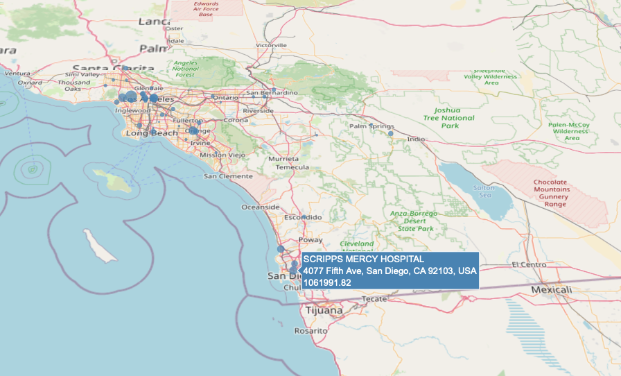

## CMS Payments to Teaching Hospitals 2018

### About
Interactive map plot of payments made by drug and medical device companies to physicians and teaching hospitals which can include money for meals, travel and gifts. The data is available as part of a national transparency program from the US Government. The map displays hospital locations and total monies received in 2018 using data reported by the <a href="https://openpaymentsdata.cms.gov"> Centers for Medicare and Medicaid Services and was retrieved using the  Open Payments API </a>. 

### Deployed on Github Pages
Click on this <a href='https://sherirosalia.github.io/cms_hospital_payments/'><strong>link </strong></a>to view the interactive projection created in Plotly. Hospital location and total money received in display on hover.

### Frameworks
Google Map API, Plotly and Python. 

### File Structure
- The app.py script contains the api call for openpaymentsdata.cms.gov.
- Index file is Plotly generated html.
- The geocoding script is in geocode.py.
- The hospitals_map.py creates the Plotly map.
- Data at various stages are in the CSV files.
- Screenshots in the img folder.

### US Map

### Port Jefferson, NY

### Stony Brook, NY

### Manhattan, NY

### San Diego, CA

### Ponce, Puerto Rico

